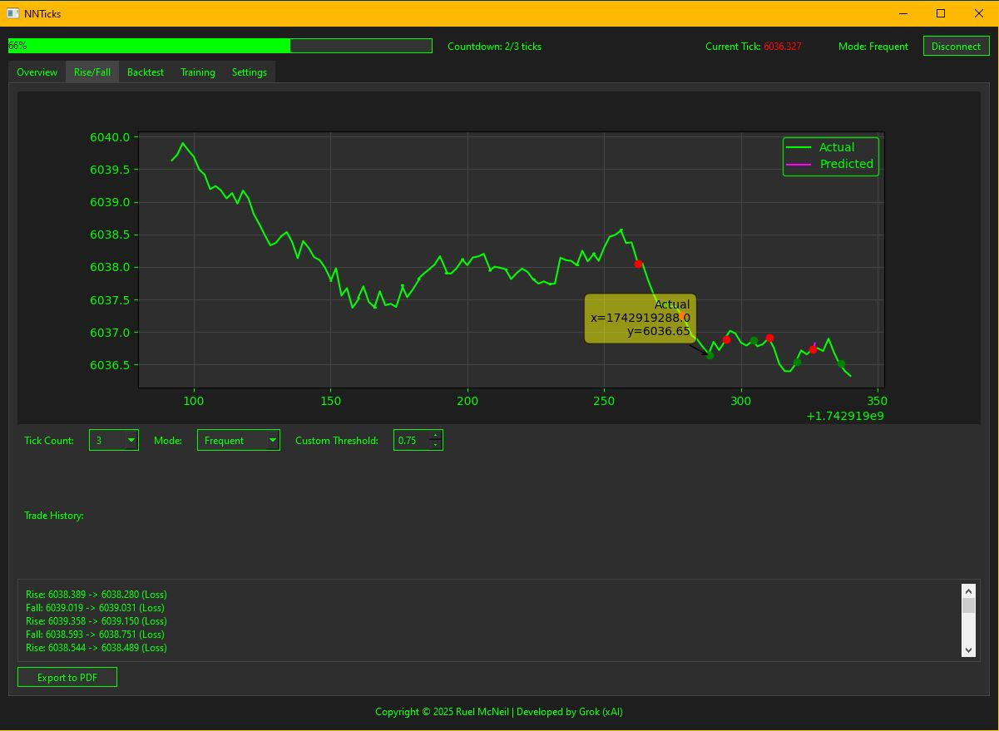
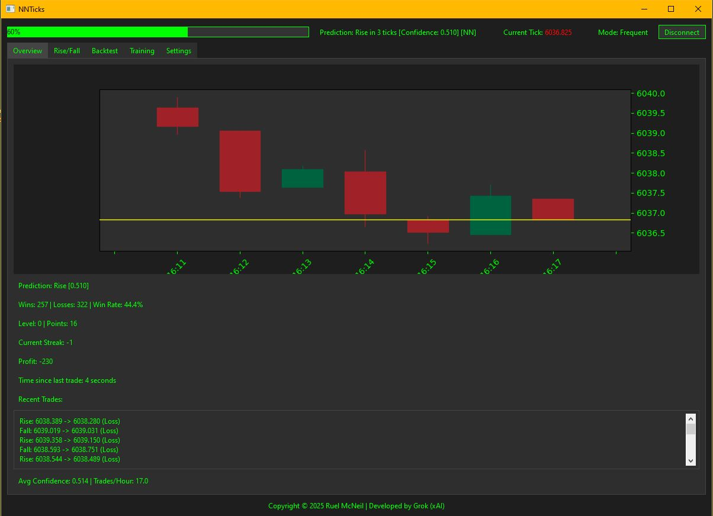
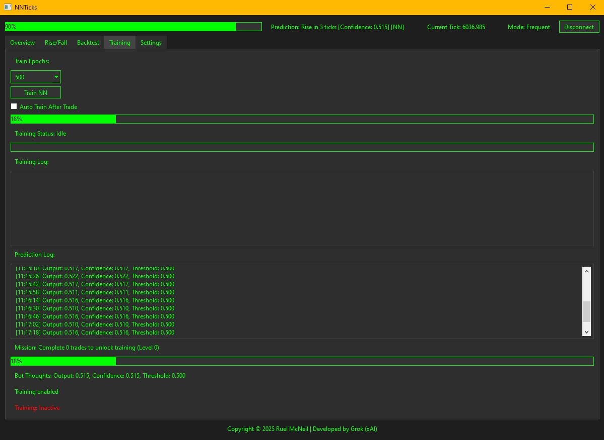
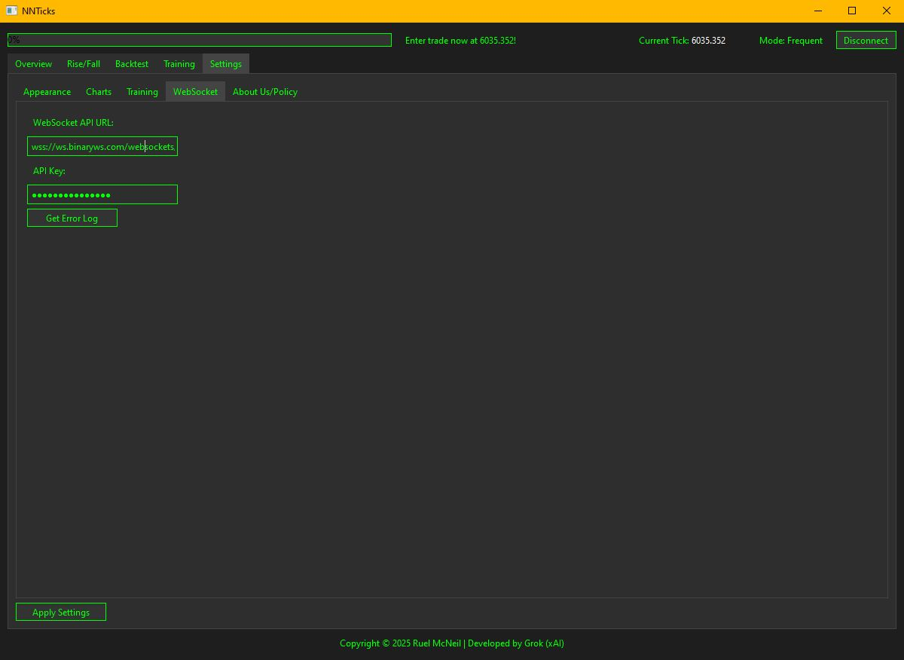

# 🧠 NNTicks


**NNTicks** is a desktop neural-network-based tick predictor built in Python. It’s designed for binary tick trading and supports real-time predictions, neural network training, backtesting, and live visualization — all within a sleek PyQt6 interface.

---

## 🚧 Project Status

This project is currently in **active development**.  
Features, structure, and UI may change. Contributions and feedback are welcome!

---

## 🖼️ Screenshots

### 📈 Live Tick Chart & Prediction Output


### 📊 Candlestick Prediction Mode


### 🧪 Neural Network Training Interface


### ⚙️ Settings Panel


---

## 🧩 Architecture Diagram (Text-Based)

```
                          +-----------------+
                          |    config.py    |
                          |-----------------|
                          | API keys,       |
                          | symbol,         |
                          | constants       |
                          +--------+--------+
                                   |
                                   v
+-------------------+      +--------------------+      +---------------------+
|     gui.py        |----->|   data_handler.py  |----->|   prediction.py     |
|-------------------|      |--------------------|      |---------------------|
| Starts interface  |      | Connects to market |      | Predicts tick dir.  |
| & logic           |      | Handles WebSocket  |      | Neural Net training |
+-------------------+      +--------------------+      +---------------------+
                                                             |
                                                             v
                                                      +--------------+
                                                      |  model.pkl   |
                                                      | (saved NN)   |
                                                      +--------------+
                                  GUI
                                   |
                                   v
                          +--------------------+
                          |     PyQt6 GUI      |
                          |--------------------|
                          | Charts, logs,      |
                          | buttons, input     |
                          +--------------------+
```

---

## 🔧 Features

- 📡 Real-time WebSocket tick data from Deriv
- 🧠 Neural network prediction with confidence threshold
- 🖥️ Fully interactive PyQt6 GUI
- 📈 Tick and candlestick charting modes
- 🧪 Training mode with XP & level system
- 🕹️ Manual Rise/Fall data entry
- 💾 Save/Load trained models (`model.pkl`)
- 📤 Export trade logs to PDF
- 🌙 Dark theme with clear, modern visuals

---

## 📦 Tech Stack

| Component        | Tech Used                     |
|------------------|-------------------------------|
| **Language**     | Python                        |
| **GUI Framework**| PyQt6                         |
| **ML Engine**    | Custom NumPy-based Neural Net |
| **Data Source**  | Deriv.com WebSocket API       |
| **Charting**     | Matplotlib (for visual plots) |

---

## 🚀 How to Run

1. Clone the repository:
   ```bash
   git clone https://github.com/Cruelhelp/NNTicks.git
   cd NNTicks
   ```

2. Install dependencies:
   ```bash
   pip install -r requirements.txt
   ```

3. Launch the app:
   ```bash
   python gui.py
   ```

> Make sure your API key and WebSocket URL are correctly set in `config.py`  
or enter the details in `Settings > WebSocket`.

---

## 📁 File Structure

| File              | Description                                      |
|-------------------|--------------------------------------------------|
| `gui.py`          | Launches the application and GUI logic           |
| `data_handler.py` | Handles WebSocket connection and data streaming  |
| `prediction.py`   | Neural network logic for prediction and training |
| `config.py`       | Stores constants, API keys, and symbol info      |
| `model.pkl`       | Auto-saved trained model                         |
| `screenshots/`    | Folder for UI preview images                     |
| `requirements.txt`| Python dependencies list                         |

---

## 👤 Author

**Ruel McNeil**  
📧 mcneilruel@gmail.com  
🔗 [GitHub Profile](https://github.com/Cruelhelp)

---

## 🧾 License

**MIT License**  
Developed by Ruel McNeil | Powered by Grok (xAI)
